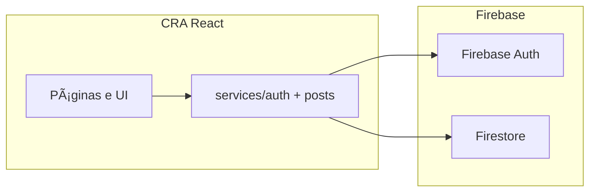

## Miniblog — React + Firebase (TypeScript)

SPA hospedada no GitHub Pages (`homepage` já define o sub-path `/Blog/`).

### Principais tecnologias

- Create React App + TypeScript estrito (`tsconfig`)
- Firebase Auth / Firestore (SDK modular v10)
- TanStack Query (cache/refetch das coleções paginadas)
- React Hook Form + Zod
- Vitest smoke + GitHub Actions
- Husky + lint-staged (Prettier)
- Firebase Security Rules + índices versionados no repo

### Arquitetura (visão rápida)



Fluxo típico: componentes chamam hooks → hooks usam TanStack Query → chamadas ficam encapsuladas em `services/` (sem SDK espalhado na UI).

### Pré-requisitos

1. Node 20 LTS (vide `.nvmrc`).
2. Conta/projeto Firebase (Auth Email/Senha + Firestore modo produção apenas após revisar Rules).
3. Instalar Firebase CLI apenas se quiser publicar Rules: `npm install -g firebase-tools`.

### Configuração rápida

```bash
npm install
cp .env.example .env.local # preencha com valores reais da consola Firebase
npm start
npm run build    # garante gates similares ao CI quando envs estão válidas
npm run test:unit
```

Consulte sempre [`docs/FIREBASE_SETUP.md`](./docs/FIREBASE_SETUP.md) para deploy de Rules/App Check/CSP/dual projeto.

### Qualidade automatizada

- `npm run test:unit` — Vitest cobre helpers puros primeiro.
- `npm test` — Jest CRA (opcional quando quiser cenários legados React).
- `npm run prepare` — instala Husky (executado após `npm install`).
- GitHub Actions `.github/workflows/ci.yml` replica `npm ci → test:unit → build` com placeholders de Firebase.

### Roadmap destacado / backlog

Consulte [`docs/CHECKLIST.md`](./docs/CHECKLIST.md) e [`CHANGELOG.md`](./CHANGELOG.md). Itens conscientemente adiados: editor rico (Tiptap), Next.js SSR, App Check obrigatório em produção, pipelines de deploy automáticos quando decidir hospedagem além de GH Pages.

### Capturas sugeridas (para README)

Substitua estes marcadores antes de portfolio público:

1. Lista de posts (tema claro).
2. Página individual com OG tags geradas pelo `react-helmet-async`.

### Deploy rápido (GitHub Pages existente)

`npm run deploy` continua a usar `gh-pages` quando `homepage` configurado — **lembre**: variáveis `REACT_APP_*` têm de existir durante `npm run build` (idealmente secrets do GitHub Actions se automatizar esta etapa).

### Segurança

- Credenciais nunca devem regressar ao Git.
- Defence real em Firestore acontece nas Rules (`firestore.rules`); faça sempre `firebase deploy --only firestore:rules`.

---

<details>
<summary>Inglês (resumo técnico)</summary>

React SPA with Firebase modular SDK, hardened Firestore Rules, TanStack Query, Zod validations, GH Actions CI, Vitest starter tests, husky prettier hook, SPA SEO limited by lack of SSR (Next migration documented). Always deploy rules after schema changes.</details>
